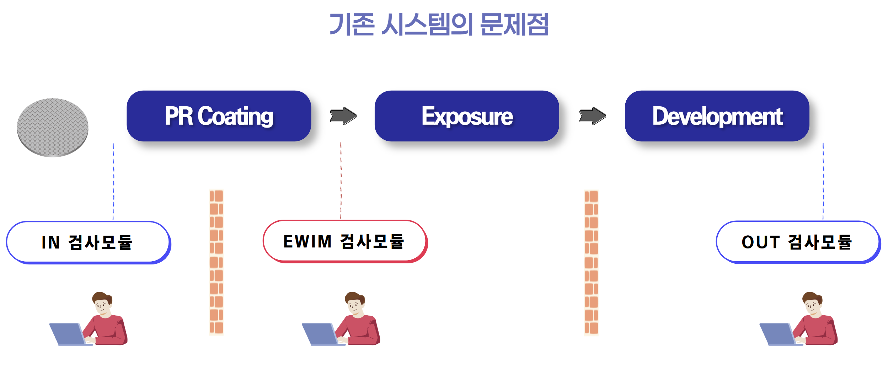
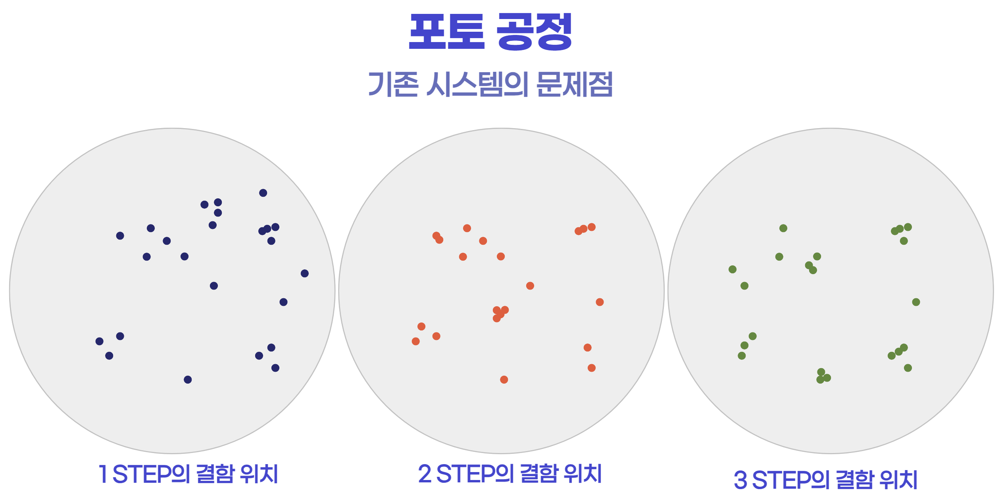
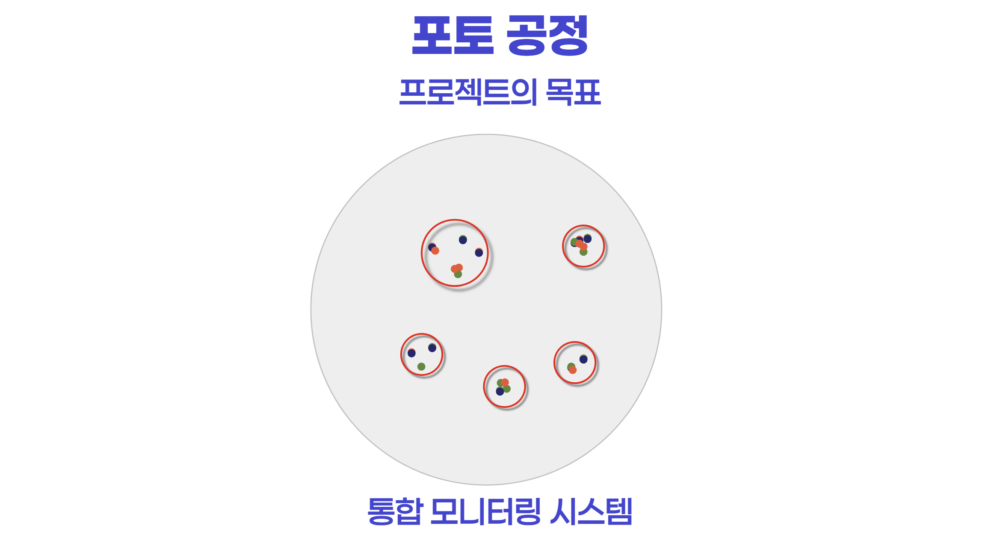
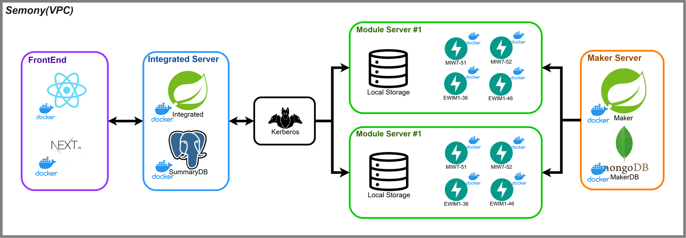
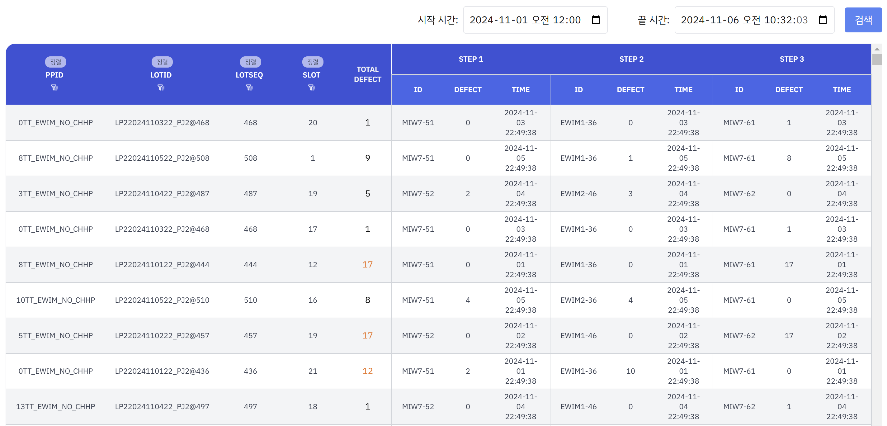
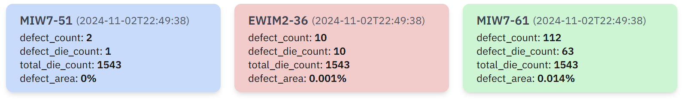
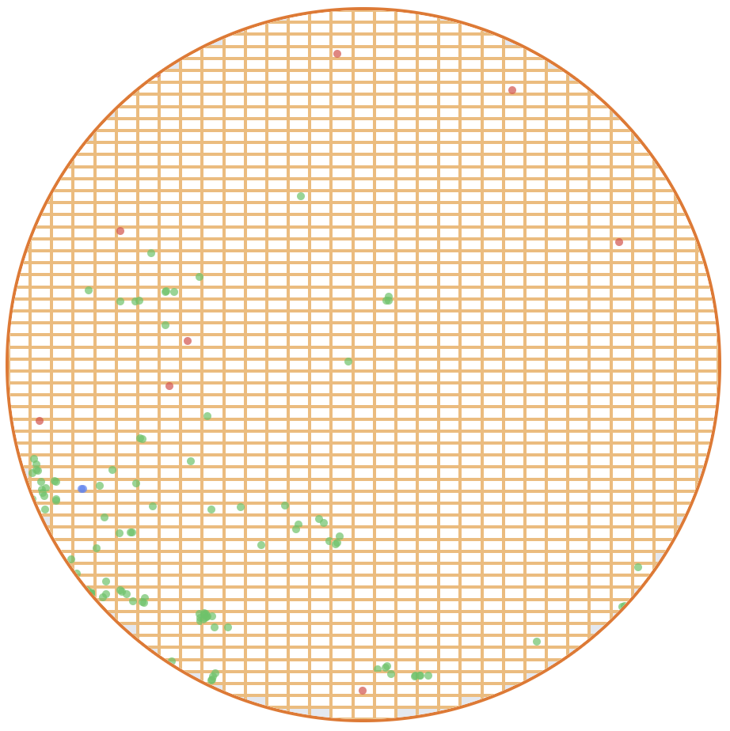
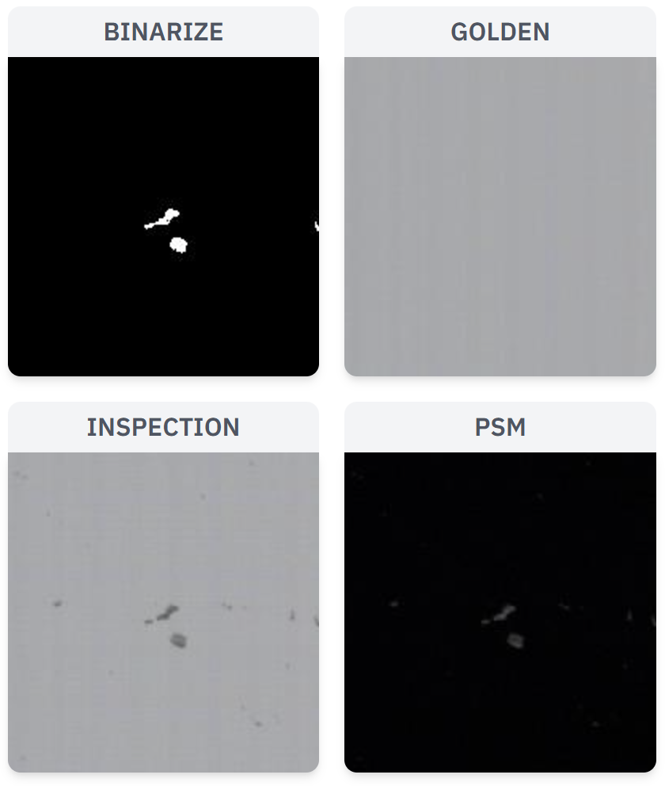
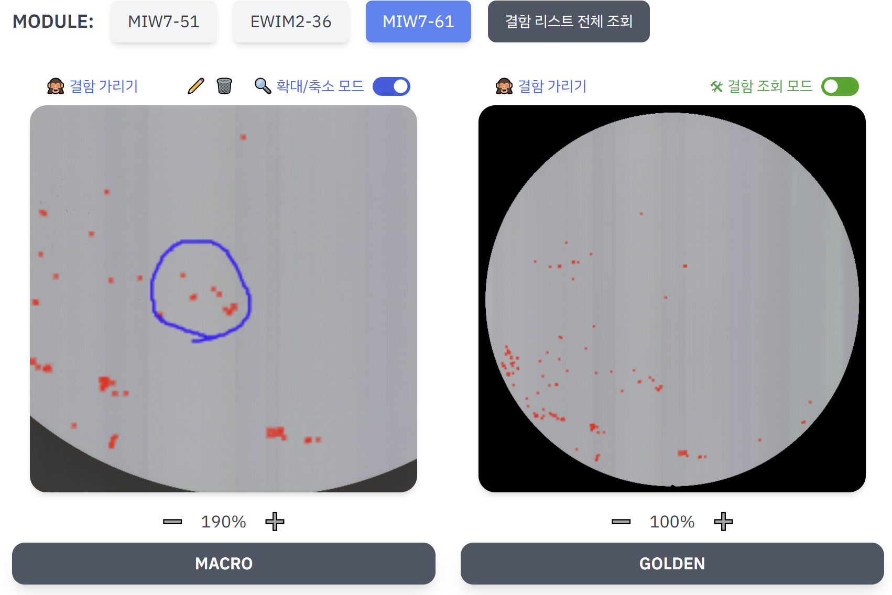
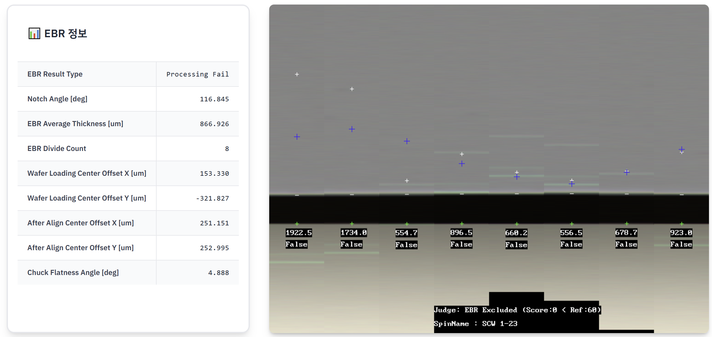

# ✨ 3-step Inspection Module Integrated Monitor ✨

    

### 프로젝트 기간 및 인원
기간 : 2024.10.14 ~ 2024.11.25 (6주)  
인원 : 4명 (FE 1명, BE 2명, INFRA 1명)

## ✨PRIZE✨

### 삼성 청년 SW 아카데미 자율프로젝트 우수상

## ✨ 서비스 소개 ✨
기존 SEMES 기업은 반도체 포토 공정에서 검사 과정은 검사 모듈에 개별적으로 접근하여 결과를 확인했다.
따라서 개별적으로 접근하는 불편함을 없애고자 검사 결과를 통합적으로 모니터링하는 시스템을 구축하고자 함

    

    

    

## 시스템 아키텍처

    

## 주요 기능
### 1. 웨이퍼 목록 조회
- <b>날짜별 조회</b> : 날짜를 지정하여 웨이퍼 목록을 조회
- <b>필터링/정렬</b> : PPID 등 여러 조건으로 필터링/정렬 기능 제공

    

### 2. 웨이퍼 상세 조회
- <b>Stacked Wafer Map</b> : 각 step 별 결함을 조회  

    

    

 
 

- <b>IPU Patch 조회</b> : 결함을 클릭하여 상세 이미지 조회

    

 
 

- <b>Macro/Golden 조회</b> : 확대/축소, 그리기 기능을 포함한 Macro/Golden 조회

    

 
 

- <b>EBR 조회</b> : EBR 조회 기능

    

 
 

- <b>모듈 네트워크 조회</b> : 모듈 네트워크 상태 확인 기능

    

## 🛠️기술 스택
- **Frontend**: 

- **BackEnd**:&nbsp;

- **DataBase**:

- **Infrastructure**:

## ⭐팀원 소개⭐

|                                     |                                                                                                                                                                   |                                      |                                                                                                                                                                            |
| ----------------------------------- | ----------------------------------------------------------------------------------------------------------------------------------------------------------------- | ------------------------------------ | -------------------------------------------------------------------------------------------------------------------------------------------------------------------------- |
|  | **김세진**   Infra   인프라 구성   [GitHub](https://github.com/hsusj996)       |  | **박지훈**   팀장, Backend   Maker 서버 개발   [GitHub](https://github.com/hyuntohoon) |
|       | **오동규**   Backend   통합 서버 개발  [GitHub](https://github.com/Eastplanet)  |            | **정희수**   Frontend    모니터링 페이지 개발   [GitHub](https://github.com/heeeeee0129)    |

